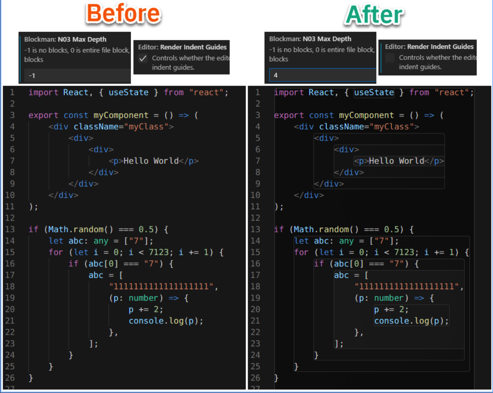
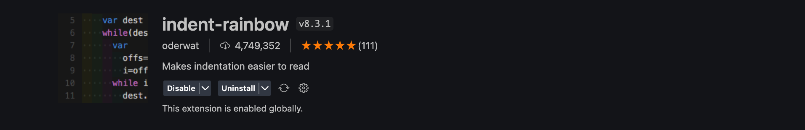

# Hướng dẫn cài các extension cloudformation và cấu hình cho Visual Studio Code

Các extension và cấu hình áp dụng cho cả file json và yaml

## Table of Contents

- [Cài extension](#cài-extension)
  - [YAML](#1-yaml)
  - [CloudFormation](#2-cloudformation)
  - [Prettier](#3-prettier)
  - [Block highlighting](#4-block-highlighting)
  - [Cloudformation Lint](#5-cloudformation-lint)
- [Cấu hình setting extension](#cấu-hình-setting-extension)
  - [Mở file settings.json](#1-mở-file-settingjson)
  - [Cấu hình setting](#2-cấu-hình)
  - [Done](#3-done)

## Cài extension

Vào phần extension của Visual Studio Code và cài các extension dưới đây:

### 1. Yaml

Extension hỗ trợ cú pháp cho file yaml.


### 2. CloudFormation

Snippet hỗ trợ code CloudFormation.


### 3. Prettier

Extension dùng để format làm đẹp code.


### 4. Block highlighting

Có thể sử dụng blockman hoặc rainbown indent tuỳ sở thích

1. Blockman
   
   

2. Indent rainbow
   
   

### 5. Cloudformation Lint


Sau khi cài đặt xong CFN Lint cần thực hiện các step sau

- Cài python và pip : [Link](https://www.python.org/)
- Cài commandline cho cfn lint

```shell
pip install cfn-lint
```

- Khởi động lại VScode

## Cấu hình setting extension

Mở Visual Studio Code và thực hiện như các bước bên dưới:

#### 1. Mở file settings.json

Nhấn Ctrl + Shift + P, tìm kiếm `setting` và chọn như sau


Thấy cửa sổ file settings.json mở ra là ok


#### 2. Cấu hình

##### 2.1. Cấu hình yaml hỗ trợ các tag của CloudFormation

Thêm đoạn json sau vào file settings.json

```json
  "yaml.schemaStore.enable": false,
  "yaml.customTags": [
    "!Base64 scalar",
    "!Cidr scalar",
    "!And sequence",
    "!Equals sequence",
    "!If sequence",
    "!Not sequence",
    "!Or sequence",
    "!Condition scalar",
    "!FindInMap sequence",
    "!GetAtt scalar",
    "!GetAtt sequence",
    "!GetAZs scalar",
    "!ImportValue scalar",
    "!Join sequence",
    "!Select sequence",
    "!Split sequence",
    "!Sub scalar",
    "!Transform mapping",
    "!Ref scalar",
  ],
```

##### 2.2. Tự động format code bằng prettier khi save file

Thêm đoạn json sau vào file settings.json (nếu đã có rồi thì bỏ qua)

```json
"editor.defaultFormatter": "esbenp.prettier-vscode",
"editor.formatOnSave": true,
"prettier.useEditorConfig": true
```

#### 3. Done

Sau khi thực hiện các bước trên, lưu file settings.json và khởi động lại Visual Studio Code.
