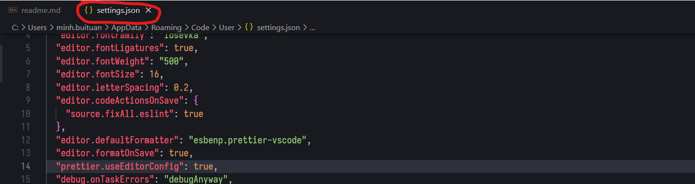

# Hướng dẫn cài các extension cloudformation và config cho Visual Studio Code

## Table of Contents

- [Cài extension](#cài-extension)
  [1. YAML by red hat](#1-yaml)
  [2. CloudFormation by aws-scripting-guide](#2-cloudformation)
  [3. Prettier by prettier](#install-and-deploy-backend-from-sources)
- [Cấu hình setting extension](#cấu-hình-setting-extension)
  [1. Mở file setting.json](#1-mở-file-settingjson)
  [2. Cấu hình setting](#2-cấu-hình)
  [3. Done](#3-done)

## Cài extension

Vào phần extension của Visual Studio Code và cài các extension dưới đây:

### 1. Yaml


### 2. CloudFormation


### 3. Prettier


### Cấu hình setting extension

Mở Visual Studio Code và thực hiện như các bước bên dưới

#### 1. Mở file setting.json

Nhấn Ctrl + Shift + P, tìm kiếm `setting` và chọn như sau:


Thấy cửa sổ file setting.json mở ra là ok


#### 2. Cấu hình

###### 2.1. Cấu hình yaml hỗ trợ các tag của CloudFormation

Thêm đoạn json sau vào file setting.json

```json
  "yaml.schemaStore.enable": false,
  "yaml.customTags": [
    "!Base64 scalar",
    "!Cidr scalar",
    "!And sequence",
    "!Equals sequence",
    "!If sequence",
    "!Not sequence",
    "!Or sequence",
    "!Condition scalar",
    "!FindInMap sequence",
    "!GetAtt scalar",
    "!GetAtt sequence",
    "!GetAZs scalar",
    "!ImportValue scalar",
    "!Join sequence",
    "!Select sequence",
    "!Split sequence",
    "!Sub scalar",
    "!Transform mapping",
    "!Ref scalar",
  ],
```

###### 2.2. Tự động format code bằng prettier khi save file

Thêm đoạn json sau vào file setting.json (nếu đã có rồi thì bỏ qua)

```json
"editor.defaultFormatter": "esbenp.prettier-vscode",
"editor.formatOnSave": true,
"prettier.useEditorConfig": true
```

#### 3. Done

Sau khi thực hiện các bước trên, lưu file setting.json và khởi động lại Visual Studio Code.
